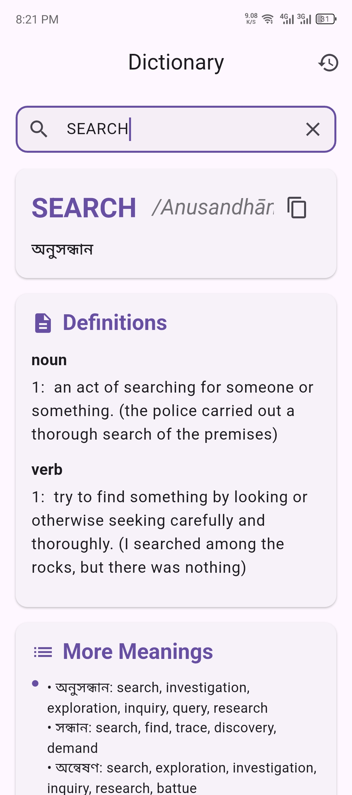
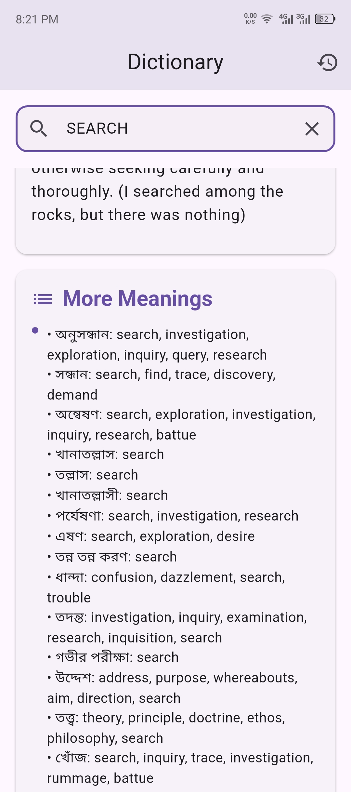

# English to Bangla Dictionary

**English to Bangla Dictionary** is a fast and lightweight mobile application built with **Flutter** that provides instant English-to-Bangla translations. It helps students, professionals, and language enthusiasts improve their vocabulary and communication skills with ease.

---

## Features

- **Instant Translation:** Quickly find accurate Bangla meanings of English words.  
- **Synonyms & Antonyms:** Explore related and opposite words to enrich your vocabulary.  
- **Offline Access:** Use the dictionary anytime, even without an internet connection.  
- **Pronunciation Support:** Listen to the correct pronunciation of English words (if enabled).  
- **Search History & Favorites:** Save and revisit frequently searched words easily.  
- **Clean & Modern UI:** Smooth, responsive interface built with Flutter for a better user experience.  

---

## Use Case

Perfect for learners, travelers, and professionals who need quick and comprehensive English-to-Bangla translations, including synonyms and antonyms, all in one app.

---

## Tech Stack

- **Framework:** Flutter  
- **Language:** Dart  

---

## Installation

1. Clone the repository:
   ```bash
   git clone https://github.com/your-username/english-to-bangla-dictionary.git
   ```

2. Navigate to the project directory:
   ```bash
   cd english-to-bangla-dictionary
   ```

3. Install dependencies:
   ```bash
   flutter pub get
   ```

4. Run the application:
   ```bash
   flutter run
   ```

---

## Some images

### 1. Search word
| **1** | **2** |
|-------|-------|
|  |  |


---

## APK

[Download Latest APK](#) <!-- Add your APK release link here -->

---

## License

This project is licensed under the [MIT License](LICENSE).
